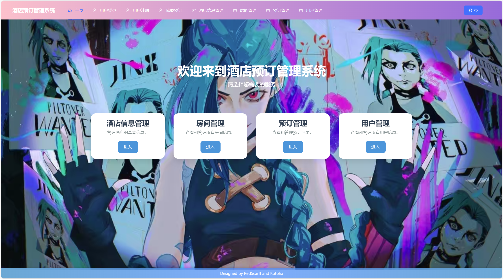

# hotel_system



src目录下存储了全部代码文件，report目录下存储了详细的说明

### **项目架构设计**

- **后端 (Django)** ：Django 负责构建 RESTful API，用于处理数据库交互、业务逻辑和身份验证。使用了Postgre数据库。
- **前端 (Vue.js)** ：Vue.js 用于实现用户界面，构建过程使用了 ant design vue 组件库，使用pinia库管理全局状态，发送请求给 Django API 并展示响应数据。
- **通信方式** ：前端通过 Axios（或其他 HTTP 客户端库）向 Django API 发送请求，并通过 JSON 格式交换数据。

**a. Django 项目**

安装 Django 和 Django REST Framework：

```bash
pip install django djangorestframework
```

* 运行
  ```bash
  python manage.py runserver
  ```
  
* 默认情况下，后端会运行在http://127.0.0.1:8000/

**b. Vue 项目**

- 安装 Node.js [https://nodejs.org/en]()
- 安装 vue 脚手架 `npm install -g @vue/cli`
- 运行

  ```
  pnpm run serve
  ```

- 默认情况下，前端会运行在http://localhost:8080/

- 跨域问题已经在my_hotel/settings.py中解决

  ```
  CORS_ALLOWED_ORIGINS = [
      "http://localhost:8080",
      ]
  ```

## 运行可能遇到的问题

- 前端在编写过程中使用了prettier进行代码规范化，可能不符合您的IDE设置，如果遇到格式之类的错误，可尝试 `npm run lint --fix` 进行修复

- 前端项目支持npm或pnpm，如果运行过程发现了某些库未安装手动安装一下即可
  可能没安装的库：`pnpm install axios` ，`pnpm install pinia`，当然如果用 npm 也是同理
  
- **运行前端** 请在hotel-frontend目录下 `npm run serve` 或  `pnpm run serve`

- **运行后端**
  请在my_hotel目录中新建local_setting.py，在这里将参数改为你的数据库设置
  在此之前，请先去数据库建立一个名为my_hotel的库（当然，如果你喜欢也可以叫别的名字，不过请记得改设置）

  ```
    # my_hotel/local_setting.py
  
    Local_DATABASES = {
        "default": {
            "ENGINE": "django.db.backends.postgresql",
            "NAME": "my_hotel",
            "USER": "postgres", # 你的用户名
            "PASSWORD": "", # 你的密码
            "HOST": "127.0.0.1",
            "PORT": "5432",
        }
    }
  ```

  数据库迁移：现在回到src目录，找到manage.py

  `python manage.py makemigrations` or `python manage.py makemigrations hotel`

  `python manage.py migrate`

  后端启动：`python manage.py runserver`
  
- 这是作者第一次写出如此庞大的项目，所以如果遇到还存在某些小bug，还望海涵，欢迎提PR

## 鸣谢搭档！
