# **数据库系统实验课程设计项目**

| 姓名   | 学号     | 主要负责部分             |
| ------ | -------- | ------------------------ |
| 徐子鑫 | 22336267 | 数据库框架设计、后端开发 |
| 王志杰 | 22331095 | 前端框架设计、前端开发   |

完整项目代码可通过 https://github.com/Red-Scarff/hotel_system 查阅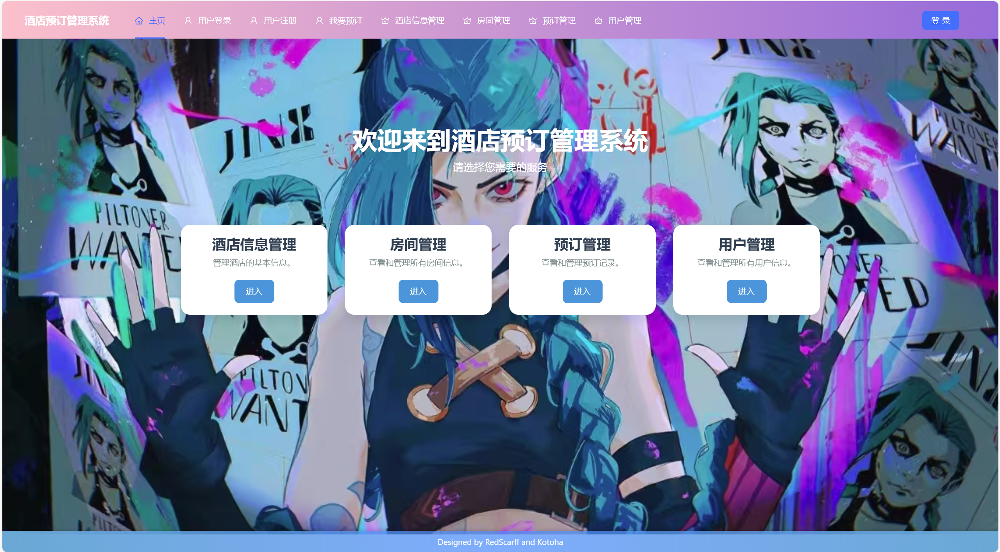

## 1. 项目要求

以**Postgresql**、 **SQL Server**或**My SQL**等作为后台数据库，以**React**、 **Vue**、 **Angular**等或其它开发工具作为前台开发工具，完成一个小型数据库应用系统的设计开发。完成系统的分析、设计和开发。

**酒店预订管理系统的设计与实现**

设计一个酒店预订管理系统，包括酒店信息管理、房间管理、预订管理等功能。酒店信息管理负责酒店信息的添加、修改和查询；房间管理负责房间信息的添加、修改和查询；预订管理负责预订信息的录入、修改和查询。

**要求：**

(1) **针对给定的系统进行需求分析，设计系统结构图和系统功能模块图；**

(2) **针对需求分析，画出**E-R**图表示的概念模型，并将其转换为至少满足**3NF**的关系模式，设计较为合理的数据库模式**；

(3) **系统中应能体现对数据库的保护（安全性、完整性等）；**

(4) **系统应该有较为友好的用户界面；**

## 2. 项目需求分析

### a. 系统结构图

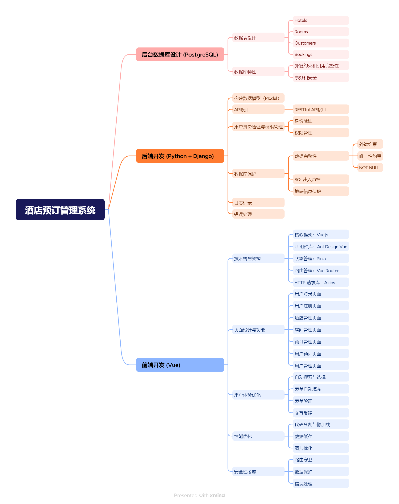

### b. 系统功能模块图

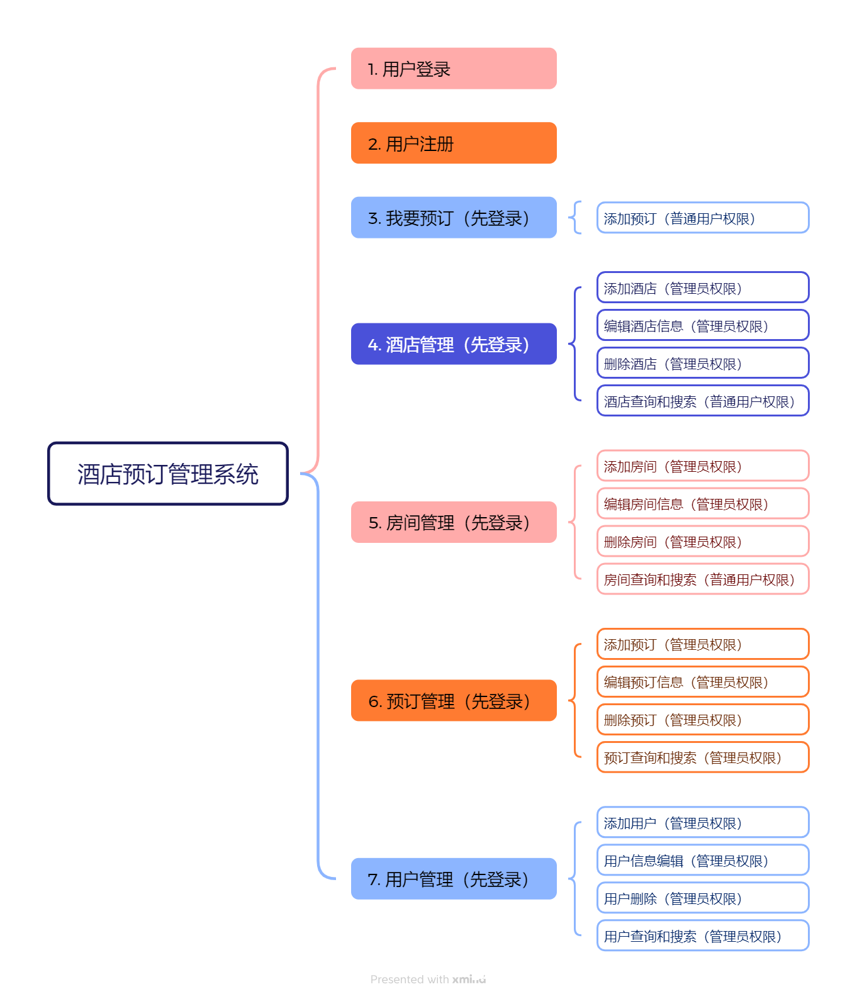

### c. E-R图

根据需求的分析，我们画出E-R图如下：

* **酒店信息管理** ：酒店信息的添加、修改和查询。
* **房间管理** ：房间信息的添加、修改和查询。
* **预订管理** ：预订信息的录入、修改和查询。


## 3. 项目总览

### a. 后台数据库设计 (PostgreSQL)

**数据表设计** ：根据项目需求，建议创建以下表：

+ **Hotels** ：包含酒店的基本信息（例如名称、地址、联系方式等）。
+ **Rooms** ：包含房间信息（房号、房型、价格、状态等）。
+ **Bookings** ：包含预订信息（用户ID、房间ID、入住和离开日期、状态等）。
+ **Users** ：用户表，存储系统中用户的身份和权限等。

**外键约束和引用完整性** ：确保数据库设计的外键约束，避免不一致数据的出现。
**事务和安全** ：为需要原子性操作的任务（例如预订操作）使用事务控制，确保一致性。

**关系模式:**

* Hotels (HotelID, Name, Location, Phone, Email)
* Rooms (RoomID, HotelID, RoomType, Capacity, Price, Description)
* Customers (CustomerID, FirstName, LastName, Phone, Email, Address)
* Bookings (BookingID, CustomerID, RoomID, CheckInDate, CheckOutDate, TotalPrice, Status)

---

### b. 后端开发 (Python + Django)

+ **后端**：Django 负责构建 RESTful API，用于处理数据库交互、业务逻辑和身份验证。

Django 是一个用 Python 编写的高层次 Web 框架，主要特点包括：

1. **ORM（对象关系映射）** ：Django自带ORM，可以直接将Python对象映射到数据库表，简化数据库交互。
2. **认证系统** ：Django内置了身份验证和用户管理功能，帮助开发者快速实现用户登录、注册、权限控制等功能。
3. **权限管理** ：Django拥有内置的权限系统，允许为不同用户或用户组分配不同权限，方便控制访问权限。
4. **自动生成的管理界面** ：Django提供一个强大的后台管理界面，自动生成管理页面来管理数据。
5. **快速开发** ：Django推崇“少即是多”的设计原则，通过一站式的架构帮助快速开发复杂应用。

因为Django内置了丰富的功能，适合项目逻辑复杂、数据库操作频繁的应用，是许多开发者构建Web应用的首选框架之一。

**1. 构建数据模型（Model）**

* 使用ORM（对象关系映射）来简化数据库操作，便于将Python对象直接映射到PostgreSQL的表中。
* 关键模型及字段：
  * **Hotel** ：`id`（主键）、`name`、`address`、`contact`等。
  * **Room** ：`id`（主键）、`hotel_id`（外键，指向Hotel）、`room_number`、`room_type`、`price`、`status`等。
  * **Booking** ：`id`（主键）、`user_id`、`room_id`（外键，指向Room）、`check_in`、`check_out`、`status`等。
  * **User** ：`id`（主键）、`username`、`password_hash`（存储哈希密码）、`role`（管理员、前台、客人等）等。

**2. API设计**

* **设计RESTful API接口** ：每个实体（如Hotel、Room、Booking、User）有基本的CRUD（增删改查）接口。
* **示例API** ：
  * `POST /hotels/`：添加酒店信息
  * `GET /hotels/<hotel_id>/`：获取指定酒店信息
  * `POST /rooms/`：添加房间信息
  * `POST /bookings/`：创建新的预订
  * `PUT /bookings/<booking_id>/`：更新预订状态

**3. 用户身份验证与权限管理**

* **身份验证** ：使用token实现安全的会话管理。用户在登录后会获取一个token，之后每次请求携带该token来验证身份。
* **权限管理** ：不同角色（如管理员、用户等）在不同操作上的权限有所不同。

**4. 处理数据库保护（安全性和完整性）**

* **数据完整性** ：定义了必要的外键约束、唯一性约束、NOT NULL等字段约束，确保数据质量。
* **SQL注入防护** ：使用ORM避免手动拼接SQL语句，防止SQL注入。
* **敏感信息保护** ：如用户密码应通过哈希存储（如bcrypt、Argon2），避免了直接存储明文密码。

**5. 日志记录与错误处理**

* **日志记录** ：配置日志记录模块（例如logging库），记录关键事件（如用户登录、预订操作等），帮助后续系统维护和问题排查。
* **错误处理** ：设计标准的错误响应机制，对常见错误（如404、500）提供清晰的反馈；确保敏感信息不暴露给前端。

### c. 前端开发 (Vue)

在酒店管理系统的前端开发中，我们采用了 **Vue.js** 作为核心框架，并结合 **Ant Design Vue** 组件库，构建了一个功能丰富、用户体验友好的单页应用（SPA）。以下是前端开发的总体设计：

1. **技术栈与架构**

   - **核心框架**：Vue.js
     - Vue.js 是一个渐进式 JavaScript 框架，通过响应式数据绑定和组件化开发，简化了前端开发流程。
     - 使用 Vue 3 的 Composition API，提升了代码的可维护性和复用性。
   - **UI 组件库**：Ant Design Vue
     - Ant Design Vue 提供了丰富的 UI 组件（如表格、表单、按钮、弹窗等），帮助我们快速构建美观且功能强大的用户界面。
     - 通过 Ant Design 的布局组件（如 `a-layout`、`a-row`、`a-col`），实现了页面的响应式布局。
   - **状态管理**：Pinia
     - Pinia 是 Vue 3 推荐的状态管理库，用于管理全局状态（如用户登录信息、权限等）。
     - 通过 Pinia，我们实现了用户登录状态的全局共享和同步。
   - **路由管理**：Vue Router
     - 使用 Vue Router 实现页面路由跳转，支持动态路由和路由守卫，确保用户在不同页面之间的无缝切换。
     - 通过路由守卫，限制未登录用户访问敏感页面（如管理页面），提升系统安全性。

   - **HTTP 请求库**：Axios
     - Axios 是一个基于 Promise 的 HTTP 客户端，用于与后端 RESTful API 进行数据交互。
     - 通过封装 Axios 请求，实现了统一的 API 调用和错误处理机制。

2. **页面设计与功能**

   - **用户登录页面 (`UserLoginPage.vue`)**：
     - 提供用户名和密码输入框，支持表单验证。
     - 登录成功后，用户信息存储在 Pinia 中，并重定向到首页。
   - **用户注册页面 (`UserRegisterPage.vue`)**：
     - 提供用户名和密码输入框，支持表单验证。
     - 注册成功后，自动登录用户并重定向到首页。
   - **酒店管理页面 (`HotelManagePage.vue`)**：
     - 展示酒店列表，支持添加、编辑和删除酒店信息。
     - 通过 `a-table` 组件展示数据，通过 `a-modal` 组件实现表单弹窗。
   - **房间管理页面 (`RoomManagePage.vue`)**：
     - 展示房间列表，支持添加、编辑和删除房间信息。
     - 通过 `a-select` 组件实现酒店选择功能，提升用户体验。
   - **预订管理页面 (`BookingManagePage.vue`)**：
     - 展示预订列表，支持添加、编辑和删除预订信息。
     - 通过表单验证确保预订信息的完整性。
   - **用户预订页面 (`UserBookingPage.vue`)**：
     - 允许用户选择房间、填写入住和退房日期，并自动计算总价格。
     - 通过表单验证确保用户输入的日期和房间信息有效。

   - **用户管理页面 (`UserManagePage.vue`)**：
     - 展示用户列表，支持添加、编辑和删除用户信息。
     - 通过表单验证确保用户名和密码等必填项已填写。

3. **用户体验优化**

   - **自动搜索与选择**：
     - 在酒店和房间选择功能中，通过 `a-select` 组件实现自动搜索和选择弹窗，提升用户操作效率。
     - 用户无需手动输入酒店名称，只需从下拉框中选择即可。
   - **表单自动填充**：
     - 在编辑模式下，系统会自动将当前条目的已有信息填充到表单中，减少用户输入操作。
     - 通过 `Object.assign` 方法实现表单字段的自动填充。
   - **表单验证**：
     - 使用 Ant Design 的 `a-form` 组件实现表单验证，确保用户输入的数据符合要求。
     - 通过 `rules` 属性定义验证规则，如必填项、最小长度等。

   - **交互反馈**：
     - 使用 Ant Design 的 `message` 和 `notification` 组件，为用户提供操作成功或失败的提示信息。
     - 在数据加载或提交时，使用 `a-spin` 组件显示加载状态，避免用户误操作。

4. **性能优化**

   - **代码分割与懒加载**：
     - 通过 Vue Router 的懒加载功能，将页面组件按需加载，减少初始加载时间。
     - 使用 Vue 3 的异步组件，进一步提升页面加载速度。
   - **数据缓存**：
     - 使用 Pinia 或 localStorage 缓存常用数据（如用户信息、酒店列表），减少不必要的 API 调用。
     - 通过缓存机制，提升系统的响应速度和用户体验。

   - **图片优化**：
     - 对页面中的图片进行压缩和懒加载，减少页面加载时间。
     - 使用 `img` 标签的 `loading="lazy"` 属性，实现图片的懒加载。

5. **安全性考虑**

   - **路由守卫**：
     - 通过 Vue Router 的路由守卫功能，限制未登录用户访问敏感页面（如管理页面）。
     - 在路由跳转前，检查用户登录状态和权限，确保系统安全性。
   - **数据保护**：
     - 在发送敏感数据（如用户密码）时，使用 HTTPS 加密传输，避免数据泄露。
     - 通过哈希算法（如 bcrypt）存储用户密码，避免明文存储。

   - **错误处理**：
     - 在 API 调用失败时，提供友好的错误提示信息，避免用户困惑。
     - 通过 Axios 的拦截器，统一处理 HTTP 错误响应。

## 4. 后台数据库设计 (PostgreSQL)

### a. 数据库关系模式设计

**1. 酒店信息表（Hotels）**

* **功能** ：存储酒店的基本信息。
* **主键** ：`HotelID`

---

| 字段名       | 数据类型     | 描述         |
| ------------ | ------------ | ------------ |
| `HotelID`  | INT (主键)   | 酒店唯一标识 |
| `Name`     | VARCHAR(100) | 酒店名称     |
| `Location` | VARCHAR(255) | 酒店地址     |
| `Phone`    | VARCHAR(15)  | 联系电话     |
| `Email`    | VARCHAR(100) | 邮箱地址     |

**2. 房间信息表（Rooms）**

* **功能** ：存储每个酒店的房间信息。
* **主键** ：`RoomID`
* **外键** ：`HotelID`（关联 Hotels 表）

---

| 字段名          | 数据类型       | 描述                         |
| --------------- | -------------- | ---------------------------- |
| `RoomID`      | INT (主键)     | 房间唯一标识                 |
| `HotelID`     | INT (外键)     | 所属酒店的 ID                |
| `RoomType`    | VARCHAR(50)    | 房间类型（如单人间、双人间） |
| `Capacity`    | INT            | 容量（人数）                 |
| `Price`       | DECIMAL(10, 2) | 每晚价格                     |
| `Description` | TEXT           | 房间描述                     |

**3. 客户信息表（Customers）**

* **功能** ：存储客户的基本信息。
* **主键** ：`CustomerID`

---

| 字段名         | 数据类型     | 描述         |
| -------------- | ------------ | ------------ |
| `CustomerID` | INT (主键)   | 客户唯一标识 |
| `FirstName`  | VARCHAR(50)  | 姓名         |
| `LastName`   | VARCHAR(50)  | 姓           |
| `Phone`      | VARCHAR(15)  | 联系电话     |
| `Email`      | VARCHAR(100) | 邮箱地址     |
| `Address`    | VARCHAR(255) | 地址         |

**4. 预订信息表（Bookings）**

* **功能** ：记录每次预订的详细信息。
* **主键** ：`BookingID`
* **外键** ：`RoomID`（关联 Rooms 表），`CustomerID`（关联 Customers 表）

---

| 字段名           | 数据类型       | 描述                         |
| ---------------- | -------------- | ---------------------------- |
| `BookingID`    | INT (主键)     | 预订唯一标识                 |
| `CustomerID`   | INT (外键)     | 预订的客户 ID                |
| `RoomID`       | INT (外键)     | 预订的房间 ID                |
| `CheckInDate`  | DATE           | 入住日期                     |
| `CheckOutDate` | DATE           | 退房日期                     |
| `TotalPrice`   | DECIMAL(10, 2) | 总价格                       |
| `Status`       | VARCHAR(20)    | 预订状态（如已确认、已取消） |

### b. model.py

`# Src/hotel/model.py`

我们在这里进行了数据库模型的实现

+ User

**扩展用户模型** ：

* 使用 Django 自带的 `AbstractUser`  创建自定义用户模型。
* 为用户添加角色字段（ `role` 字段）来区分身份。
* 并且创建身份函数来判断身份

```
class User(AbstractUser):
    phone = models.CharField(max_length=15, blank=True, null=True)
    ROLE_CHOICES = (
        ('customer', 'Customer'),
        ('manager', 'Hotel Manager'),
    )
    role = models.CharField(max_length=20, choices=ROLE_CHOICES, default='customer')

    def is_customer(self):
        return self.role == 'customer'

    def is_manager(self):
        return self.role == 'manager'
```

+ Hotel

根据上述的数据库模型实现了Hotel

```
# 酒店模型
class Hotel(models.Model):
    name = models.CharField(max_length=100, verbose_name="酒店名称")
    location = models.CharField(max_length=255, verbose_name="地址")
    phone = models.CharField(max_length=15, verbose_name="联系电话")
    email = models.EmailField(verbose_name="邮箱地址")
  

    def __str__(self):
        return f"{self.name} - {self.location}"

    class Meta:
        verbose_name = "酒店"
        verbose_name_plural = "酒店管理"
        ordering = ["name"]  # 按酒店名称排序
```

+ Room

以酒店作为外键， 根据上述的数据库模型实现了Room

```
# 房间模型
class Room(models.Model):
    hotel = models.ForeignKey(Hotel, on_delete=models.CASCADE, verbose_name="所属酒店")
    room_type = models.CharField(max_length=50, verbose_name="房间类型")
    capacity = models.PositiveIntegerField(verbose_name="容纳人数")
    price = models.DecimalField(max_digits=10, decimal_places=2, verbose_name="每晚价格")
    description = models.TextField(blank=True, verbose_name="房间描述")

    def __str__(self):
        return f"{self.hotel.name} - {self.room_type} - {self.price}元"

    class Meta:
        verbose_name = "房间"
        verbose_name_plural = "房间管理"
        ordering = ["hotel", "room_type"]
```

+ Booking

以Hotel以及Room为外键，根据上述的数据库模型实现了Booking

```
# 预订模型
class Booking(models.Model):
    user = models.ForeignKey(User, on_delete=models.CASCADE, default=1, verbose_name="客户id")
    room = models.ForeignKey(Room, on_delete=models.CASCADE, verbose_name="房间")
    customer_name = models.CharField(max_length=100, verbose_name="客户姓名")
    check_in_date = models.DateField(verbose_name="入住日期")
    check_out_date = models.DateField(verbose_name="退房日期")
    total_price = models.DecimalField(max_digits=10, decimal_places=2, verbose_name="总价格")
    status = models.CharField(
        max_length=20,
        choices=[("confirmed", "已确认"), ("cancelled", "已取消")],
        default="confirmed",
        verbose_name="预订状态",
    )

    def __str__(self):
        return f"预订 - {self.customer_name} - {self.room}"

    class Meta:
        verbose_name = "预订"
        verbose_name_plural = "预订管理"
        ordering = ["-check_in_date"]
```

### c. 数据库效果

在postgre中我们可以看到数据库共有如下表


+ User


+ Hotel


+ Room


+ Booking


### d. 满足3NF的验证

**1.满足1NF（第一范式）：**

* 所有表的字段都只包含原子值（不可再分）。
* 表中每个字段只存储单一的信息，没有多值属性。

**2.满足2NF（第二范式）：**

* 每个非主属性完全依赖于主键，没有部分依赖。
  * 例如：`Rooms` 表的非主属性（如 `RoomType`、`Price` 等）完全依赖于主键 `RoomID`，而不是部分依赖于外键 `HotelID`。

**3.满足3NF（第三范式）：**

* 消除了传递依赖，所有非主属性都直接依赖于主键。
  * 例如：在 `Bookings` 表中，`TotalPrice` 直接依赖于主键 `BookingID`，没有间接依赖于 `CustomerID` 或 `RoomID`。

---

## 5. 后端开发 (Python + Django)

我们首先创建了名为my_hotel的django项目，随后创建了名为hotel的app作为我们开发的主要框架

我们使用Django Restful Framework来构建标准的api

### a. 用户管理

如上文(3.a)所述，为了满足对于客户和酒店管理人员的区分，我们选择自定义用户类来进行用户管理

Django 提供了一个强大的认证系统，包含了用户管理、认证（login/logout）、权限管理等功能。其核心功能包括：

1. **用户认证（Authentication）** ：验证用户身份的过程。
2. **授权（Authorization）** ：确定用户是否有权执行某些操作。
3. **权限（Permissions）** ：基于角色或者具体用户进行操作限制。

Django 内置的认证系统通过 `User` 模型、`groups`、`permissions` 等字段来管理用户、用户角色以及权限。

**1. 内置 `User` 模型**

Django 提供了一个默认的 `User` 模型，存储了用户的基本信息。这个模型包括了以下字段：

* `username`：用户名，唯一标识一个用户。
* `password`：加密的用户密码。
* `email`：用户的电子邮箱地址。
* `first_name` 和 `last_name`：用户的姓名。
* `is_active`：指示该用户是否活跃。
* `is_staff`：指示该用户是否为管理员。
* `is_superuser`：指示该用户是否是超级用户（拥有所有权限）。

```python
from django.contrib.auth.models import User
```

在使用 Django 默认的 `User` 模型时，所有的用户管理都可以通过 `django.contrib.auth` 进行。例如，创建用户、修改密码、检查权限等。

**2. 自定义用户模型**

Django 提供了自定义用户模型的能力，允许我们扩展 `User` 模型，添加自定义字段或行为。这对于需要在用户模型上增加额外信息（比如 `role` 字段）非常有用。

**继承 `AbstractUser`** ：

* `AbstractUser` 是 Django 默认的 `User` 模型的基础类，已经提供了很多常见字段（如用户名、密码、电子邮件等）。

```python
from django.contrib.auth.models import AbstractUser
from django.db import models

class User(AbstractUser):
    ROLE_CHOICES = (
        ('customer', 'Customer'),
        ('manager', 'Manager'),
    )
    role = models.CharField(max_length=20, choices=ROLE_CHOICES, default='customer')
```

**在 `settings.py` 中指定自定义用户模型** ：

+ 在项目的 `settings.py` 文件中，通过 `AUTH_USER_MODEL` 设置自定义的用户模型：

```python
AUTH_USER_MODEL = 'hotel.User'
```

这样，Django 就会使用我们自定义的 `User` 模型，而不是默认的 `User` 模型。

我们将用户类注册到 `admin.py`中，这样我们便可以使用django的用户管理界面进行管理

```
from django.contrib import admin
from django.contrib.auth.admin import UserAdmin
from .models import User  # 导入自定义用户模型

# 使用 UserAdmin 配置你的用户模型
@admin.register(User)
class CustomUserAdmin(UserAdmin):
    list_display = ('username', 'email', 'role', 'is_staff', 'is_active')  # 自定义显示字段
    fieldsets = (
        (None, {'fields': ('username', 'password')}),
        ('Personal info', {'fields': ('email', 'first_name', 'last_name', 'role')}),
        ('Permissions', {'fields': ('is_active', 'is_staff', 'is_superuser', 'groups', 'user_permissions')}),
        ('Important dates', {'fields': ('last_login', 'date_joined')}),
    )
    add_fieldsets = (
        (None, {
            'classes': ('wide',),
            'fields': ('username', 'email', 'role', 'password1', 'password2', 'is_active', 'is_staff')}
        ),
    )

```

进入 `http://127.0.0.1:8000/admin/`我们就可以轻松的进行用户管理


也可以对用户信息进行修改


### b. serializers.py

在上文中，我们已经根据数据库的设计，定义了我们的models，我们创建serializers.py来编写我们的自定义序列化器。

序列化器是django restful framework 所提供的，序列化器允许将复杂数据（例如查询集和模型实例）转换为原生 Python 数据类型，然后可以轻松将其渲染为 `JSON`或 `XML`其他内容类型。序列化器还提供反序列化，允许在首先验证传入数据后将解析的数据转换回复杂类型。

我们的自定义序列化器继承于serializers.ModelSerializer，这允许我们简介的通过以下方法定义自己的序列化器，只需将所需的数据从模型的字段中选出，放入fields中。

```
from rest_framework import serializers
from django.contrib.auth import get_user_model

from hotel.models import Hotel, Room, Booking

class HotelSerializer(serializers.ModelSerializer):
    class Meta:
        model = Hotel
        fields = ['id', 'name', 'location', 'phone', 'email']
  
class RoomSerializer(serializers.ModelSerializer):
    class Meta:
        model = Room
        fields = ['id', 'hotel', 'room_type', 'capacity', 'price', 'description']
  
class BookingSerializer(serializers.ModelSerializer):
    class Meta:
        model = Booking
        fields = ['id', 'user', 'room', 'customer_name', 'check_in_date', 'check_out_date', 'total_price', 'status']
```

在用户的序列化器中，我们重构了create方法

在 `User` 模型里，密码字段使用的是 Django 内部的  **哈希存储机制** ，不能直接存储明文密码。

所以，在 **序列化器 (Serializer)** 中，我们需要专门处理密码的写入，因为：

1. **安全性** ：确保密码不会作为明文存储。
2. **验证加密** ：通过 `set_password()` 方法来对密码进行加密。
3. **API 设计** ：允许用户通过 API 端点传递明文密码进行注册。

---

**为什么要重新定义 password 字段？**

* 当我们接收用户注册时，用户通过 API 传递明文密码。
* 如果我们不做额外处理，直接将密码保存到模型中，它将被当作普通字符串存储，不会加密。
* 所以，我们在 `create()` 方法中，手动调用 `set_password()` 来加密密码。

**如果不定义 password 字段会怎样？**

如果不显式定义 `password` 字段并调用 `set_password()`：

1. 通过 API 传入的密码会直接以明文存储在数据库中。
2. 这样，Django 的用户验证机制（比如登录）会失败，因为它会尝试与加密后的密码进行比对。

---

我们定义 `password` 字段， **接收用户传入的明文密码** ，并在 `create()` 或 `update()` 方法中使用 `set_password()` 加密后存储到数据库中，确保用户密码的安全性。

```
class UserSerializer(serializers.ModelSerializer):
    # 添加password，并设置 write_only 保证安全性
    password = serializers.CharField(write_only=True, required=True)

    class Meta:
        model = get_user_model()
        fields = ['id', 'username', 'first_name', 'last_name', 'email', 'phone', 'password']
        extra_kwargs = {'password': {'write_only': True}}

    def create(self, validated_data):
        # 提取明文密码
        password = validated_data.pop('password', None)
        # 创建用户对象，但不保存到数据库
        instance = self.Meta.model(**validated_data)
        if password:
            # 调用 set_password 方法将密码加密
            instance.set_password(password)
        # 保存用户对象到数据库
        instance.save()
        return instance

```

### c. views.py

我们在这里编写视图，构建我们的api，我们采用 ModelViewSet作为父类

在 Django REST framework (DRF) 中，**ViewSet** 是一种高级抽象，专门用于简化视图的编写，它将多个操作（如 `list`, `retrieve`, `create`, `update`, `destroy`）合并到单一类中。ViewSet 的核心目的是提供一个符合 RESTful 规范的 API 端点，同时减少重复代码。

以下是 ViewSet 编写的规范和流程：

**1. 使用基类**

* **`ViewSet`** ：最基础的类，需要手动定义行为方法（如 `list`, `create`）。
* **`ModelViewSet`** ：常用，自动处理 CRUD 操作，适合操作数据库模型的 API。

**2. 序列化器**

* 每个 ViewSet 通常会搭配一个序列化器（`Serializer`），如我们上面所编写的，用于定义 API 数据的输入输出格式。

**3. 路由绑定**

* 使用 `DefaultRouter` 或 `SimpleRouter` 为 ViewSet 自动生成路由。

**4. 权限控制**

* 配置 `permission_classes`，确保资源的访问符合权限要求。

**5. 查询优化**

* 配置 `queryset` 和 `get_queryset` 方法，确保高效的数据查询。

**6. 自定义动作**

* 通过 `@action` 装饰器定义额外的非标准 RESTful 操作。

通过这种方式，我们可以实现一个清晰、规范、可扩展的 RESTful API。

---

#### permissions.py

Django REST Framework 提供了 `permissions` 模块，可以基于请求的用户角色实现权限控制。

在 `permissions.py` 文件中定义自定义权限类：

```
from rest_framework.permissions import BasePermission

class IsCustomerReadOnly(BasePermission):

    def has_permission(self, request, view):
        # 所有用户可以访问列表视图 (GET 方法)
        if request.method in ['GET', 'HEAD', 'OPTIONS']:
            return True

        # 仅角色为 Manager 的用户可以进行写操作
        return request.user.is_authenticated and request.user.is_manager()

```

通过此方式实现后：

1. **即使前端被绕过** ，后端依然会根据用户角色验证权限，确保 Customer 不能执行写操作。
2. **用户体验**更加友好，前端动态渲染界面减少了无效操作。

这样，`Customer` 和 `Manager` 的权限范围清晰，系统安全性和灵活性都得到保证。

#### HotelViewSet， RoomViewSet，BookingViewSet

+ 在视图里面，通过viewsets.ModelViewSet，我们自动就可以支持CRUD（增删改查）的操作。
+ 并且引入搜索功能，支持在指定字段里面的搜索。
+ 并且为api加上权限的保护，仅支持有 `permissions`的操作，在后端保证了数据库的安全

```
class HotelViewSet(viewsets.ModelViewSet):

    queryset = Hotel.objects.all()
    serializer_class = HotelSerializer
    permission_classes = [IsCustomerReadOnly]
    filter_backends = [filters.SearchFilter]
    search_fields = ['name', 'location']  # 支持搜索的字段  
  
class RoomViewSet(viewsets.ModelViewSet):

    queryset = Room.objects.all()
    serializer_class = RoomSerializer
    permission_classes = [IsCustomerReadOnly]
    filter_backends = [filters.SearchFilter]
    search_fields = ['hotel__id', 'room_type']  # 支持搜索的字段  

  
class BookingViewSet(viewsets.ModelViewSet):

    queryset = Booking.objects.all()
    serializer_class = BookingSerializer
    filter_backends = [filters.SearchFilter]
    search_fields = ['customer_name']  # 支持搜索的字段  
    permission_classes = [permissions.IsAuthenticated]
```

#### UserViewSet

除了以上CRUD（增删改查）的操作，我们还为User实现了login的api，为用户提供登录的操作

在login中，我们会验证账号密码的正确性，若错误，将会返回error

若正确，将会返回token，用于登录后信息的验证

```
class UserViewSet(viewsets.ModelViewSet):
    """
    用户视图集合: 提供增删改查以及注册功能
    """
    queryset = get_user_model().objects.all()
    serializer_class = UserSerializer
    permission_classes = [permissions.AllowAny]  # 允许任何人访问（注册）
    filter_backends = [filters.SearchFilter]
    search_fields = ['username']  # 支持搜索的字段  

    def get_permissions(self):
        """
        根据请求方法设置不同权限
        """
        if self.action == 'create' or self.action == 'login':  # 注册
            return [permissions.AllowAny()]
        return [permissions.IsAuthenticated()]  # 其他操作需要认证


    @action(detail=False, methods=['post'], url_path='login')
    def login(self, request):
        """
        Custom login action for UserViewSet.
        """
        username = request.data.get('username')
        password = request.data.get('password')

        if not username or not password:
            return Response({"error": "Username and password are required."}, status=status.HTTP_400_BAD_REQUEST)

        # Authenticate user
        user = authenticate(request, username=username, password=password)
        if not user:
            return Response({"error": "Invalid username or password."}, status=status.HTTP_401_UNAUTHORIZED)

        if user.is_customer():
            role = 'customer'
        elif user.is_manager():
            role = 'manager'
        else:
            return Response({'message': 'Role not recognized'}, status=status.HTTP_403_FORBIDDEN)
  
        token, created = Token.objects.get_or_create(user=user)

        # Return the token and user details
        return Response({
            "message": "Login successful.",
            "token": token.key,
            "role": role,
            "user": {
                "id": user.id,
                "username": user.username,
                "email": user.email,
            }
        }, status=status.HTTP_200_OK)
```

#### token

在 Django Rest Framework (DRF) 中，认证和权限的机制通常是通过 **认证 (Authentication)** 和 **权限 (Permissions)** 来实现的。登录后，前端需要使用返回的 **token** 来验证用户身份，从而获取访问权限。

认证是指系统如何识别用户身份。Django Rest Framework 提供了几种认证方式，最常用的是  **Token 认证** 。当用户成功登录时，后端会返回一个  **token** ，前端每次请求时，都需要在请求头中带上这个 token 来验证用户身份。

**1. 前端如何获取权限**

在用户登录成功后，后端会返回一个  **token** ，这个 **token** 是唯一的身份标识。前端可以将该 token 存储在浏览器的 localStorage 或 sessionStorage 中，并且每次发请求时，通过 HTTP 请求头将 token 发送给后端。

**认证过程的流程：**

+ **用户登录：**

  用户在前端输入用户名和密码，发送到后端 `/users/login/`。
  后端验证用户名和密码正确，成功后返回一个  **token** 。
+ **前端存储 token：**
  前端将收到的 token 存储在 `localStorage` 或 `sessionStorage` 中。比如：

  ```js
  localStorage.setItem('authToken', token);
  ```

  之后的每次请求都会带上这个 token。
+ **带 token 发起请求：**
  前端每次发请求时，需要将 token 加入到请求头中，通常是加在 `Authorization` 字段中：

  ```js
  fetch('/api/some_endpoint/', {
    method: 'GET',
    headers: {
      'Authorization': 'Token ' + localStorage.getItem('authToken'),
    },
  })
  .then(response => response.json())
  .then(data => console.log(data));
  ```

**2. 后端如何验证用户身份**

在后端，DRF 会根据请求头中的 `Authorization` 字段来检查用户身份。使用 `TokenAuthentication` 类进行 token 认证。每次请求时，系统会通过解析请求头中的 token 来识别用户是否已登录。

**步骤：**

* **TokenAuthentication** 会检查请求中的 `Authorization` 字段是否包含一个有效的 token。
* 如果 token 存在且有效，Django 会为该请求用户设置 `request.user`。
* 如果 token 无效或缺失，系统会返回 401 Unauthorized 错误。

**3. 使用权限控制**

在后端，使用 **permissions** 来控制不同用户的访问权限。

* **IsAuthenticated** : 只允许已认证的用户访问。
* **IsAdminUser** : 只允许管理员用户访问。
* **Custom Permission** : 根据自定义规则决定是否允许访问。正是前文所述的自定义permission

可以通过后台管理我们的token


### d. urls.py

我们在这里为 API 配置路由

由于我们使用了ViewSet，我们可以在这里使用 `DefaultRouter` 为 ViewSet 自动生成路由。

```
from django.urls import path, include
from rest_framework.routers import DefaultRouter

from .views import HotelViewSet, RoomViewSet, BookingViewSet, UserViewSet

# Create a router and register our ViewSets with it.
router = DefaultRouter()
router.register(r'hotels', HotelViewSet)
router.register(r'rooms', RoomViewSet)
router.register(r'bookings', BookingViewSet)
router.register(r'users', UserViewSet, basename='user')

# The API URLs are now determined automatically by the router.
urlpatterns = [
    path('', include(router.urls)),
]
```

在 `my_hotel.urls.py`中，将我们app的路由加入

```
from django.contrib import admin
from django.urls import path, include

urlpatterns = [
    path("admin/", admin.site.urls),
    path('', include('hotel.urls')),
]

```

### e. 后端运行

在my_hotel目录中新建local_setting.py，在这里将参数改为你的数据库设置

去数据库建立一个名为my_hotel的库

```
  # my_hotel/local_setting.py

  Local_DATABASES = {
      "default": {
          "ENGINE": "django.db.backends.postgresql",
          "NAME": "my_hotel",
          "USER": "postgres", # 你的用户名
          "PASSWORD": "", # 你的密码
          "HOST": "127.0.0.1",
          "PORT": "5432",
      }
  }
```

数据库迁移：现在回到src目录，找到manage.py

`python manage.py makemigrations` or `python manage.py makemigrations hotel`

`python manage.py migrate`

后端启动：`python manage.py runserver`

以管理员进入 `http://127.0.0.1:8000/` 我们可以在这里看到所有的api 并且测试api的效果，已经查看信息的格式


如：get


search


### f. api

使用resource表示hotel, User, Booking, Room, 我们实现了以下API 接口：

| **HTTP 方法** | **URL 动作**     | **描述**                             |
| ------------------- | ---------------------- | ------------------------------------------ |
| `GET`             | `/resource/`         | 列出所有资源（List）                       |
| `POST`            | `/resource/`         | 创建一个新的资源（Create）                 |
| `GET`             | `/resource/{id}/`    | 获取单个资源的详细信息（Retrieve）         |
| `PUT`             | `/resource/{id}/`    | 更新单个资源（完全更新）（Update）         |
| `PATCH`           | `/resource/{id}/`    | 更新单个资源（部分更新）（Partial Update） |
| `DELETE`          | `/resource/{id}/`    | 删除单个资源（Delete）                     |
| `GET`             | `/resource/?search=` | 搜索资源 (Search)                          |
| `POST`            | `/User/login/`       | 登录 (Login)                               |

## 6. 前端开发 (Vue)

前端部分用Vue.js实现用户界面，使用了vue-cli脚手架，构建过程使用了 ant design vue 组件库，使用pinia库管理全局状态，发送请求给 Django API 并展示响应数据。

由于前端部分代码实在太长，这里只做大致的介绍并给出关键的部分代码，所有的代码都位于hotel_system/src/hotel-frontend/src下

### a. 基本的页面设计

这一部分的代码参见pages/HomePage, components/GlobalHeader和layouts/BasicLayout

1. **页面布局与结构**

   - **整体布局**：系统采用了经典的上下布局结构，顶部为导航栏（`GlobalHeader`），中间为内容区域（`router-view`），底部为页脚（`Footer`）。这种布局简洁清晰，便于用户快速定位和操作。

   - **导航栏**：导航栏位于页面顶部，包含系统标题、菜单项和用户登录状态。菜单项通过`a-menu`组件实现，支持水平排列，用户可以通过点击菜单项跳转到不同页面。

   - **内容区域**：内容区域根据路由动态加载不同的页面组件，如主页、用户登录、酒店管理等页面。

   - **页脚**：页脚固定在页面底部，显示系统设计者信息，背景采用渐变色，提升视觉效果。

2. **页面功能模块**

   - **主页（`HomePage`）**：主页展示了系统的核心功能入口，通过卡片形式呈现“酒店信息管理”、“房间管理”、“预订管理”和“用户管理”等功能模块。每个卡片包含功能描述和进入按钮，用户点击按钮即可跳转到相应页面。

   - **导航功能**：通过`GlobalHeader`中的菜单项，用户可以快速访问系统的各个功能模块，如用户登录、用户注册、酒店管理、房间管理等。

   - **用户登录状态**：导航栏右侧显示用户登录状态，若用户已登录，则显示用户名；若未登录，则显示“登录”按钮，点击按钮跳转到登录页面。

3. **视觉设计**

   - **配色方案**：系统采用了柔和的渐变色作为背景，如顶部导航栏的粉紫色渐变和页脚的蓝白色渐变，提升了页面的现代感和美观度。

   - **卡片设计**：主页的功能入口采用卡片式设计，卡片背景为白色，搭配阴影和悬停效果，增强了交互感和视觉层次。

   - **字体与图标**：系统使用了清晰的字体和Ant Design的图标库，确保页面内容易于阅读和理解。

4. **交互设计**

   - **路由跳转**：通过`vue-router`实现页面之间的无缝跳转，用户点击菜单项或功能入口按钮时，页面会平滑过渡到目标页面。

   - **动态菜单选中状态**：导航栏菜单项会根据当前路由自动高亮显示，帮助用户快速识别所在页面。

   - **按钮交互**：按钮设计了悬停和点击效果，如主页卡片的“进入”按钮在悬停时会放大，点击时会有缩放效果，提升了用户的交互体验。

5. **响应式设计**

   - **布局适配**：系统采用了`a-row`和`a-col`等布局组件，确保页面在不同屏幕尺寸下都能保持良好的显示效果。

   - **卡片布局**：主页的功能卡片采用了`flex`布局，并支持换行显示，确保在移动设备上也能正常排列和展示。

6. **效果**

   

### b. 全局状态管理

这部分代码参见store/useLoginUserStore

在系统中，全局状态管理通过 **Pinia** 实现，用于管理用户的登录状态及相关信息。通过全局状态管理，可以在接下来的设计中很好的区分用户身份，并用这种方式给管理员特权。

Pinia 是 Vue 3 官方推荐的状态管理库，具有轻量、易用和类型安全的特点。以下是全局状态管理的具体设计：

1. **状态定义**

- **`loginUser` 状态**：
  使用 `ref` 定义了一个 `loginUser` 对象，用于存储当前登录用户的信息，包括：

  - `username`：用户名。
  - `token`：用户的身份验证令牌。
  - `userRole`：用户的角色（如普通用户、管理员等）。

  ```
  const loginUser = ref<any>({
    username: "",
    token: "",
    userRole: "",
  });
  ```

2. **状态操作**

- **`fetchLoginUser` 方法**：
  用于从远程获取登录用户信息并更新 `loginUser` 状态。该方法接收一个响应对象 `res`，从中提取用户信息并赋值给 `loginUser`。

  ```
  async function fetchLoginUser(res: any) {
    loginUser.value.username = res.data.user.username;
    loginUser.value.token = res.data.token;
    loginUser.value.userRole = res.data.role;
  }
  ```

- **`setLoginUser` 方法**：（不过这个没用上）
  用于直接设置 `loginUser` 状态。该方法接收一个用户对象 `user`，并将其赋值给 `loginUser`。

  ```
  function setLoginUser(user: any) {
    loginUser.value = user;
  }
  ```

### c. 路由控制

这部分代码在router/index和access中给出

路由控制主要包括路由配置和全局路由守卫两部分，确保用户能够根据其角色和登录状态访问相应的页面。

#### 1. **路由配置**

- **路由定义**：
  在 `index.ts` 中，使用 `createRouter` 创建路由实例，并通过 `routes` 数组定义系统的所有路由。每个路由包含 `path`（路径）、`name`（路由名称）和 `component`（对应的组件）。

  ```
  const routes: Array<RouteRecordRaw> = [
    {
      path: "/",
      name: "home",
      component: HomePage,
    },
    {
      path: "/user/login",
      name: "userLogin",
      component: UserLoginPage,
    },
    {
      path: "/user/register",
      name: "userRegister",
      component: UserRegisterPage,
    },
    {
      path: "/user/booking",
      name: "userBooking",
      component: UserBookingPage,
    },
    {
      path: "/admin/userManage",
      name: "adminUserManage",
      component: UserManagePage,
    },
    {
      path: "/admin/hotelManage",
      name: "adminHotelManage",
      component: HotelManagePage,
    },
    {
      path: "/admin/RoomManage",
      name: "adminRoomManage",
      component: RoomManagePage,
    },
    {
      path: "/admin/bookingManage",
      name: "adminBookingManage",
      component: BookingManagePage,
    },
  ];
  ```

- **路由模式**：
  使用 `createWebHistory` 创建基于 HTML5 History API 的路由模式，支持无哈希的 URL，提升用户体验。

  ```
  const router = createRouter({
    history: createWebHistory(process.env.BASE_URL),
    routes,
  });
  ```

#### 2. **全局路由守卫**

- **路由守卫的作用**：
  在 `access.ts` 中，通过 `router.beforeEach` 实现全局路由守卫，用于在用户访问页面之前进行权限验证。

  ```
  router.beforeEach((to, from, next) => {
    const loginUserStore = useLoginUserStore();
    const loginUser = loginUserStore.loginUser;
    const to_url = to.path;
  });
  ```

- **权限验证逻辑**：

  - **管理员页面和用户预订页面**：
    如果用户尝试访问以 `/admin/` 或 `/user/booking` 开头的页面，系统会检查用户是否已登录。如果未登录，则跳转到登录页面，并附带重定向 URL。这是为了保证只有在登陆情况下用户才能预订或查看相关信息。

    ```
    if (to_url.startsWith("/admin/") || to_url.startsWith("/user/booking")) {
      if (!loginUser || loginUser.userRole === "") {
        message.error("请先登录");
        next("/user/login?redirect=" + to_url);
        return;
      }
    }
    ```

  - **管理员专属页面**：
    如果用户尝试访问 `/admin/bookingManage` 或 `/admin/userManage` 页面，系统会进一步检查用户角色是否为 `manager`。如果不是，则提示无权访问。

    ```
    if (
      (to_url.startsWith("/admin/bookingManage") ||
        to_url.startsWith("/admin/userManage")) &&
      loginUser.userRole !== "manager"
    ) {
      message.error("抱歉，您无权访问此页面");
      return;
    }
    ```

  - **其他页面**：
    对于无需权限验证的页面（如主页、登录页、注册页等），系统直接放行。

    ```
    else {
      next();
    }
    ```

### d. 调用后端api

这部分代码主要在api/user中给出

在系统中，后端 API 的调用通过封装好的 `myAxios` 实例进行，所有与用户、酒店、房间和预订相关的操作都通过统一的接口与后端进行数据交互，确保每次请求都携带正确的身份验证信息（如 token）。

1. **用户管理**

   - **登录与注册**：
     提供了 `userLogin` 和 `userRegister` 方法，分别用于用户登录和注册。登录成功后，后端会返回用户信息和 token，用于后续的身份验证。

   - **用户增删改查**：
     通过 `searchUsers`、`addUsers`、`editUsers` 和 `deleteUsers` 方法，实现了用户的查询、添加、编辑和删除功能，确保管理员能够有效管理用户信息。

2. **酒店管理**
   - **酒店增删改查**：
     提供了 `searchHotels`、`addHotels`、`editHotels` 和 `deleteHotels` 方法，支持管理员对酒店信息的查询、添加、编辑和删除操作。

3. **房间管理**
   - **房间增删改查**：
     通过 `searchRooms`、`addRooms`、`editRooms` 和 `deleteRooms` 方法，实现了房间信息的查询、添加、编辑和删除功能，确保房间信息与酒店信息保持一致。

4. **预订管理**
   - **预订增删改查**：
     提供了 `searchBookings`、`addBookings`、`editBookings` 和 `deleteBookings` 方法，支持用户和管理员对预订信息的查询、添加、编辑和删除操作。
   

### e. 页面实现的细节

#### 1. **用户登录页面 (`UserLoginPage.vue`)**

用户登录页面允许用户输入用户名和密码进行登录。登录成功后，用户将被重定向到首页。

- **表单结构**：使用了 `a-form` 组件来构建登录表单，包含用户名和密码输入框。表单验证规则确保用户名和密码不能为空，且密码长度至少为6位。

  ```
  <a-form-item
    label="用户名"
    name="username"
    :rules="[{ required: true, message: '请输入用户名' }]"
  >
    <a-input v-model:value="formState.username" placeholder="请输入用户名" />
  </a-form-item>
  <a-form-item
    label="密码"
    name="password"
    :rules="[{ required: true, message: '请输入密码' }, { min: 6, message: '密码长度至少6位' }]"
  >
    <a-input-password v-model:value="formState.password" placeholder="请输入密码" />
  </a-form-item>
  ```

- **登录逻辑**：在 `onFinish` 方法中，调用 `userLogin` API 进行登录验证。登录成功后，使用 `useLoginUserStore` 存储用户信息，并重定向到首页。

  ```
  const onFinish = async (values: any) => {
    const res = await userLogin(values);
    if (res && res.data.message === "Login successful.") {
      await loginUserStore.fetchLoginUser(res);
      message.success("登录成功");
      router.push({ path: "/", replace: true });
    } else {
      message.error("登录失败，请先注册");
    }
  };
  ```

  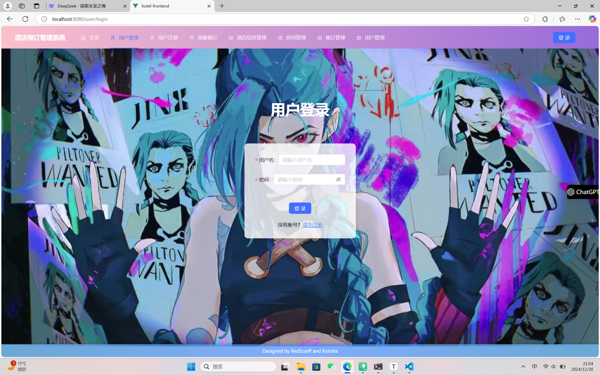

#### 2. **用户注册页面 (`UserRegisterPage.vue`)**

用户注册页面允许新用户注册账号。注册成功后，用户将自动登录并重定向到首页。

- **表单结构**：与登录页面类似，使用了 `a-form` 组件来构建注册表单，包含用户名和密码输入框。

  ```
  <a-form-item
    label="用户名"
    name="username"
    :rules="[{ required: true, message: '请输入用户名' }]"
  >
    <a-input v-model:value="formState.username" placeholder="请输入用户名" />
  </a-form-item>
  <a-form-item
    label="密码"
    name="password"
    :rules="[{ required: true, message: '请输入密码' }, { min: 6, message: '密码长度至少6位' }]"
  >
    <a-input-password v-model:value="formState.password" placeholder="请输入密码" />
  </a-form-item>
  ```

- **注册逻辑**：在 `onFinish` 方法中，调用 `userRegister` API 进行用户注册。注册成功后，自动调用 `userLogin` API 进行登录，并存储用户信息。

  ```
  const onFinish = async (values: any) => {
    const res = await userRegister(values);
    if (res && res.data.id) {
      const login_res = await userLogin({
        username: values.username,
        password: values.password,
      });
      if (login_res.data.message === "Login successful.") {
        await loginUserStore.fetchLoginUser(login_res);
        message.success("注册成功");
        router.push({ path: "/", replace: true });
      } else {
        message.error("注册失败");
      }
    }
  };
  ```

  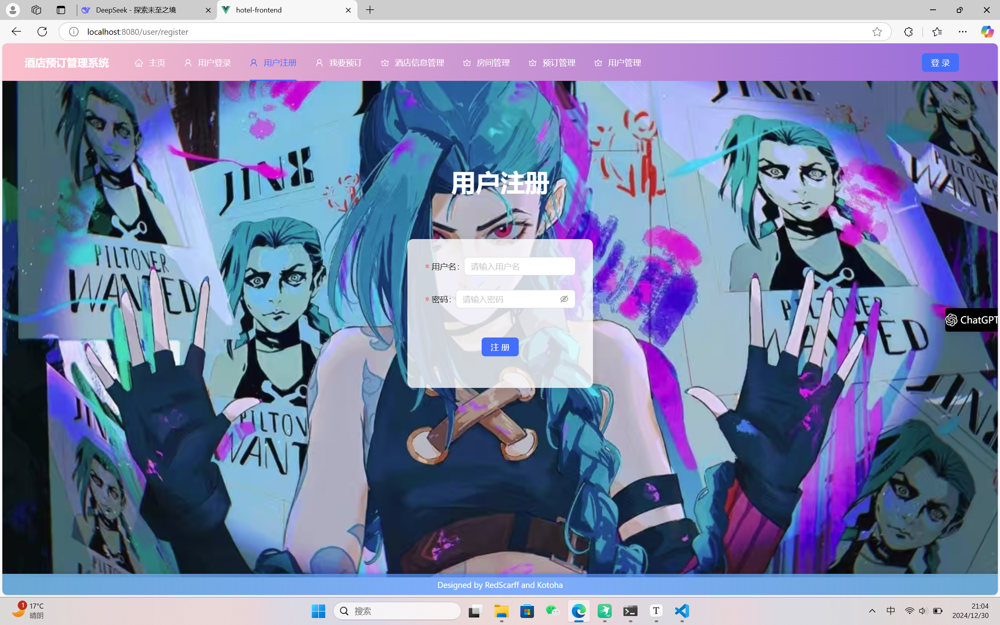

#### 3. **酒店管理页面 (`HotelManagePage.vue`)**

酒店管理页面允许管理员查看、添加、编辑和删除酒店信息。

- **表格展示**：使用 `a-table` 组件展示酒店列表，包含酒店名称、地址、电话和邮箱等信息。

  ```
  <a-table :columns="columns" :data-source="data" class="table">
    <template #bodyCell="{ column, record }">
      <template v-if="column.key === 'action'">
        <a-dropdown>
          <template #overlay>
            <a-menu>
              <a-menu-item key="1" @click="() => handleDelete(record)">删除</a-menu-item>
              <a-menu-item key="2" @click="() => handleEdit(record)">修改</a-menu-item>
            </a-menu>
          </template>
          <a-button>选择 <DownOutlined /></a-button>
        </a-dropdown>
      </template>
    </template>
  </a-table>
  ```

- **添加/编辑酒店**：通过 `a-modal` 组件弹出模态框，允许管理员添加或编辑酒店信息。表单验证确保所有必填项都已填写。

  ```
  <a-modal v-model:open="visible" title="新的条目内容" @ok="onOk" @cancel="onCancel">
    <a-form ref="formRef" :model="formState" layout="vertical">
      <a-form-item label="酒店名" :rules="[{ required: true, message: '请输入酒店名!' }]">
        <a-input v-model:value="formState.name" />
      </a-form-item>
      <a-form-item label="地址" :rules="[{ required: true, message: '请输入酒店地址!' }]">
        <a-input v-model:value="formState.location" />
      </a-form-item>
      <a-form-item label="电话号" :rules="[{ required: true, message: '请输入酒店电话号!' }]">
        <a-input v-model:value="formState.phone" />
      </a-form-item>
      <a-form-item label="email" :rules="[{ required: true, message: '请输入酒店email!' }]">
        <a-input v-model:value="formState.email" />
      </a-form-item>
    </a-form>
  </a-modal>
  ```

  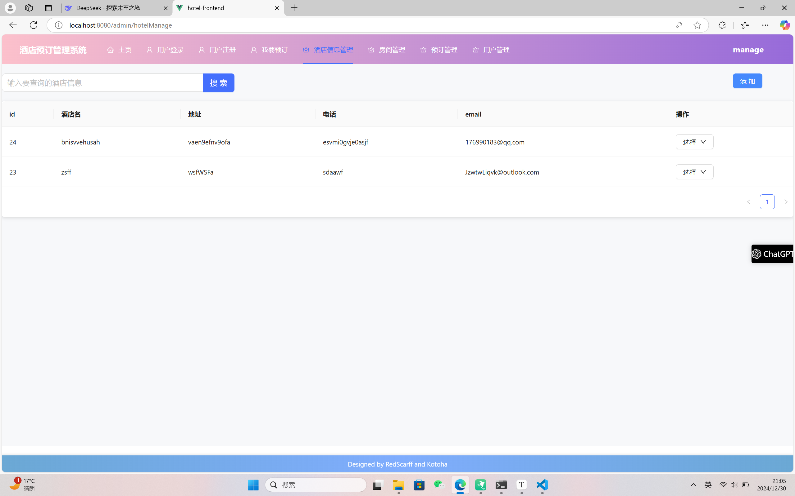

#### 4. **房间管理页面 (`RoomManagePage.vue`)**

房间管理页面允许管理员查看、添加、编辑和删除房间信息。基本是和酒店管理页面的设计是相同的

- **表格展示**：使用 `a-table` 组件展示房间列表，包含房间类型、容纳人数、价格等信息。

  ```
  <a-table :columns="columns" :data-source="data" class="table">
    <template #bodyCell="{ column, record }">
      <template v-if="column.key === 'action'">
        <a-dropdown>
          <template #overlay>
            <a-menu>
              <a-menu-item key="1" @click="() => handleDelete(record)">删除</a-menu-item>
              <a-menu-item key="2" @click="() => handleEdit(record)">修改</a-menu-item>
            </a-menu>
          </template>
          <a-button>选择 <DownOutlined /></a-button>
        </a-dropdown>
      </template>
    </template>
  </a-table>
  ```

- **添加/编辑房间**：通过 `a-modal` 组件弹出模态框，允许管理员添加或编辑房间信息。表单验证确保所有必填项都已填写。

  ```
  <a-modal v-model:open="visible" title="新的条目内容" @ok="onOk" @cancel="onCancel">
    <a-form ref="formRef" :model="formState" layout="vertical">
      <a-form-item label="所属酒店" :rules="[{ required: true, message: '请输入所属酒店!' }]">
        <a-select v-model:value="formState.hotel" placeholder="选择酒店">
          <a-select-option v-for="hotel in hotelOptions" :key="hotel.value" :value="hotel.value">
            {{ hotel.label }}
          </a-select-option>
        </a-select>
      </a-form-item>
      <a-form-item label="房间类型" :rules="[{ required: true, message: '请输入房间类型!' }]">
        <a-input v-model:value="formState.room_type" />
      </a-form-item>
      <a-form-item label="容纳人数" :rules="[{ required: true, message: '请输入容纳人数!' }]">
        <a-input v-model:value="formState.capacity" />
      </a-form-item>
      <a-form-item label="每晚价格" :rules="[{ required: true, message: '请输入每晚价格!' }]">
        <a-input v-model:value="formState.price" />
      </a-form-item>
    </a-form>
  </a-modal>
  ```

  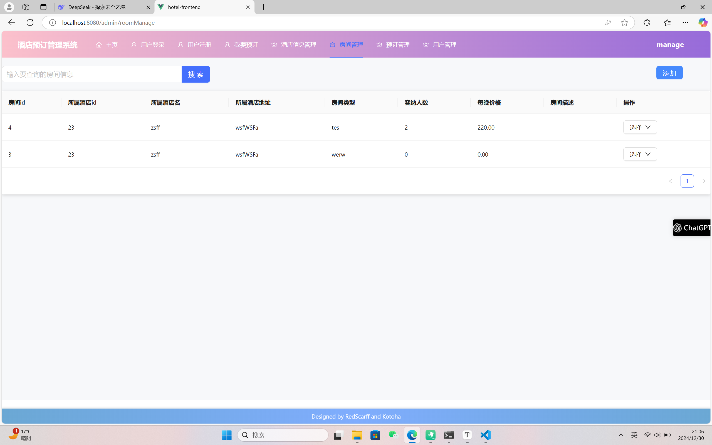

#### 5. **预订管理页面 (`BookingManagePage.vue`)**

预订管理页面允许管理员查看、添加、编辑和删除预订信息。

- **表格展示**：使用 `a-table` 组件展示预订列表，包含预订用户、房间、入住日期、退房日期等信息。

  ```
  <a-table :columns="columns" :data-source="data" class="table">
    <template #bodyCell="{ column, record }">
      <template v-if="column.key === 'action'">
        <a-dropdown>
          <template #overlay>
            <a-menu>
              <a-menu-item key="1" @click="() => handleDelete(record)">删除</a-menu-item>
              <a-menu-item key="2" @click="() => handleEdit(record)">修改</a-menu-item>
            </a-menu>
          </template>
          <a-button>选择 <DownOutlined /></a-button>
        </a-dropdown>
      </template>
    </template>
  </a-table>
  ```

- **添加/编辑预订**：通过 `a-modal` 组件弹出模态框，允许管理员添加或编辑预订信息。表单验证确保所有必填项都已填写。

  ```
  <a-modal v-model:open="visible" title="新的条目内容" @ok="onOk" @cancel="onCancel">
    <a-form ref="formRef" :model="formState" layout="vertical">
      <a-form-item label="客户昵称" :rules="[{ required: false, message: '请输入客户昵称!' }]">
        <a-select v-model:value="formState.user">
          <a-select-option v-for="user in userOptions" :key="user.value" :value="user.value">
            {{ user.label }}
          </a-select-option>
        </a-select>
      </a-form-item>
      <a-form-item label="房间" :rules="[{ required: true, message: '请输入房间!' }]">
        <a-select v-model:value="formState.room">
          <a-select-option v-for="room in roomOptions" :key="room.value" :value="room.value">
            {{ room.label }}
          </a-select-option>
        </a-select>
      </a-form-item>
      <a-form-item label="客户真实姓名" :rules="[{ required: true, message: '请输入客户真实姓名!' }]">
        <a-input v-model:value="formState.customer_name" />
      </a-form-item>
      <a-form-item label="入住日期" :rules="[{ required: true, message: '请输入入住日期!' }]">
        <a-input v-model:value="formState.check_in_date" placeholder="请输入入住日期(格式:YYYY-MM-DD)" />
      </a-form-item>
      <a-form-item label="退房日期" :rules="[{ required: true, message: '请输入退房日期!' }]">
        <a-input v-model:value="formState.check_out_date" placeholder="请输入入住日期(格式:YYYY-MM-DD)" />
      </a-form-item>
    </a-form>
  </a-modal>
  ```

  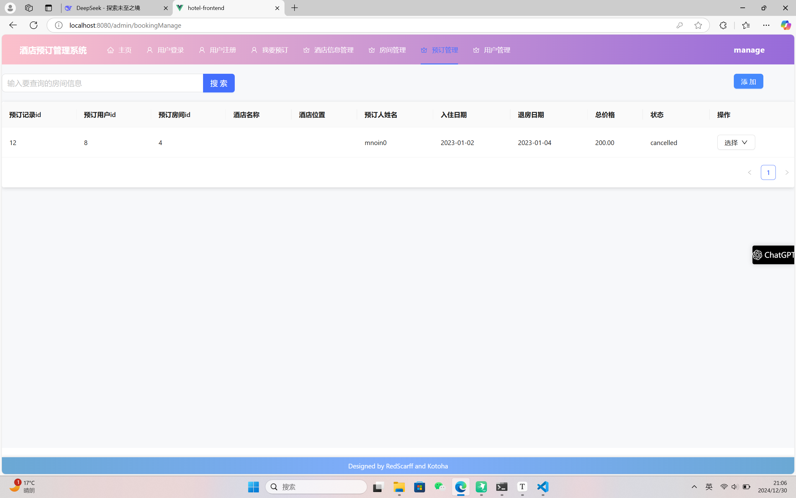

#### 6. **用户预订页面 (`UserBookingPage.vue`)**

用户预订页面允许用户进行房间预订。用户可以选择房间、填写入住和退房日期，并自动计算总价格。

- **表单结构**：使用 `a-form` 组件构建预订表单，包含房间选择、入住日期、退房日期等输入项。

  ```
  <a-form ref="formRef" :model="formState" layout="vertical">
    <a-form-item label="房间" :rules="[{ required: true, message: '请输入房间!' }]">
      <a-select v-model:value="formState.room">
        <a-select-option v-for="room in roomOptions" :key="room.value" :value="room.value">
          {{ room.label }}
        </a-select-option>
      </a-select>
    </a-form-item>
    <a-form-item label="入住日期" :rules="[{ required: true, message: '请输入入住日期!' }]">
      <a-input v-model:value="formState.check_in_date" placeholder="(格式:YYYY-MM-DD)" />
    </a-form-item>
    <a-form-item label="退房日期" :rules="[{ required: true, message: '请输入退房日期!' }]">
      <a-input v-model:value="formState.check_out_date" placeholder="(格式:YYYY-MM-DD)" />
    </a-form-item>
  </a-form>
  ```

- **预订逻辑**：在 `onOk` 方法中，计算入住天数并根据房间价格计算总价格，然后调用 `addBookings` API 进行预订。

  ```
  const onOk = async () => {
    try {
      await formRef.value.validateFields();
      const checkInDate = new Date(formState.check_in_date);
      const checkOutDate = new Date(formState.check_out_date);
      const timeDifference = checkOutDate.getTime() - checkInDate.getTime();
      const dayDifference = Math.ceil(timeDifference / (1000 * 3600 * 24));
      if (dayDifference <= 0) {
        message.error("退房日期必须晚于入住日期！");
        return;
      }
      const roomResponse = await searchRooms(formState.room, formState.token);
      const room = roomResponse.data[0];
      if (room) {
        const dailyPrice = room.price;
        formState.total_price = dailyPrice * dayDifference;
      } else {
        message.error("房间信息获取失败");
        return;
      }
      await addBookings(toRaw(formState));
      message.success("预订添加成功");
      resetForm();
    } catch (error) {
      console.error("用户预订失败:", error);
      message.error("用户预订失败");
    }
  };
  ```

  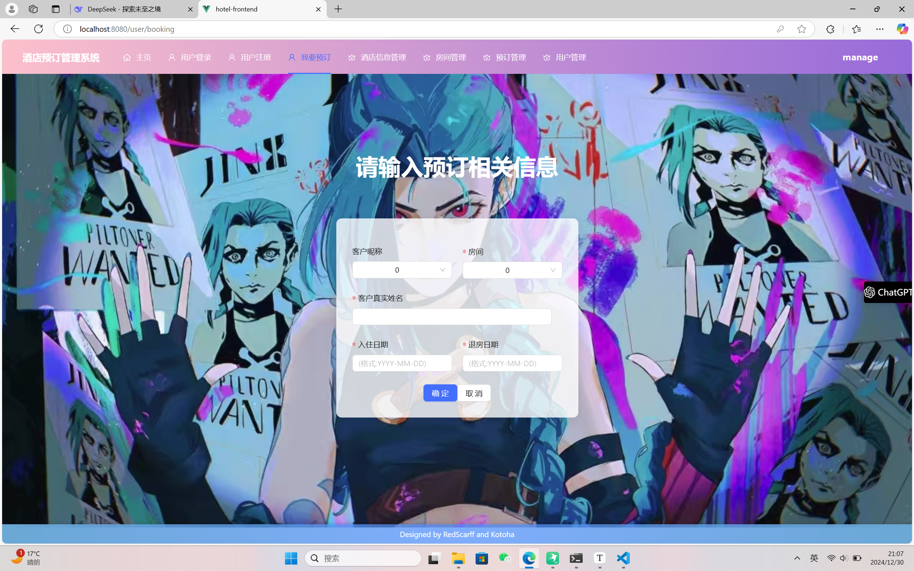

#### 7. **用户管理页面 (`UserManagePage.vue`)**

用户管理页面允许管理员查看、添加、编辑和删除用户信息。

- **表格展示**：使用 `a-table` 组件展示用户列表，包含用户昵称、姓名、电话、邮箱等信息。

  ```
  <a-table :columns="columns" :data-source="data" class="table">
    <template #bodyCell="{ column, record }">
      <template v-if="column.key === 'action'">
        <a-dropdown>
          <template #overlay>
            <a-menu>
              <a-menu-item key="1" @click="() => handleDelete(record)">删除</a-menu-item>
              <a-menu-item key="2" @click="() => handleEdit(record)">修改</a-menu-item>
            </a-menu>
          </template>
          <a-button>选择 <DownOutlined /></a-button>
        </a-dropdown>
      </template>
    </template>
  </a-table>
  ```

- **添加/编辑用户**：通过 `a-modal` 组件弹出模态框，允许管理员添加或编辑用户信息。表单验证确保用户名和密码等必填项已填写。

  ```
  <a-modal v-model:open="visible" title="新的条目内容" @ok="onOk" @cancel="onCancel">
    <a-form ref="formRef" :model="formState" layout="vertical">
      <a-form-item label="昵称" :rules="[{ required: true, message: '请输入昵称!' }]">
        <a-input v-model:value="formState.username" />
      </a-form-item>
      <a-form-item
        label="密码"
        :rules="[
          { required: true, message: '请输入密码!' },
          { min: 6, message: '密码长度至少6位' },
        ]"
      >
        <a-input v-model:value="formState.password" />
      </a-form-item>
      <a-form-item label="客户名Firstname" :rules="[{ required: false, message: '请输入客户名!' }]">
        <a-input v-model:value="formState.first_name" />
      </a-form-item>
      <a-form-item label="客户姓Lastname" :rules="[{ required: false, message: '请输入客户姓!' }]">
        <a-input v-model:value="formState.last_name" />
      </a-form-item>
      <a-form-item label="电话号" :rules="[{ required: false, message: '请输入客户联系电话!' }]">
        <a-input v-model:value="formState.phone" />
      </a-form-item>
      <a-form-item label="email" :rules="[{ required: false, message: '请输入客户email!' }]">
        <a-input v-model:value="formState.email" />
      </a-form-item>
    </a-form>
  </a-modal>
  ```

- **用户管理逻辑**：

  - **添加用户**：在 `onOk` 方法中，调用 `addUsers` API 添加新用户。
  - **编辑用户**：在 `handleEdit` 方法中，将选中用户的信息填充到表单中，调用 `editUsers` API 更新用户信息。
  - **删除用户**：在 `handleDelete` 方法中，调用 `deleteUsers` API 删除用户。

  ```
  const onOk = () => {
    formRef.value
      .validateFields()
      .then(async (values) => {
        try {
          if (formState.mode === "add") {
            await addUsers(toRaw(formState));
            message.success("用户添加成功");
          } else if (formState.mode === "edit") {
            await editUsers(toRaw(formState));
            message.success("用户信息更新成功");
          }
          fetchData("", formState.token);
        } catch (error) {
          message.error(
            formState.mode === "add" ? "添加用户失败" : "更新用户信息失败"
          );
        }
        resetForm();
      })
      .catch((info) => {
        console.log("表单验证失败:", info);
      });
  };
  
  const handleDelete = async (record?: any) => {
    await deleteUsers(record.id, formState.token);
    message.success("删除成功");
    fetchData("", formState.token);
  };
  ```

  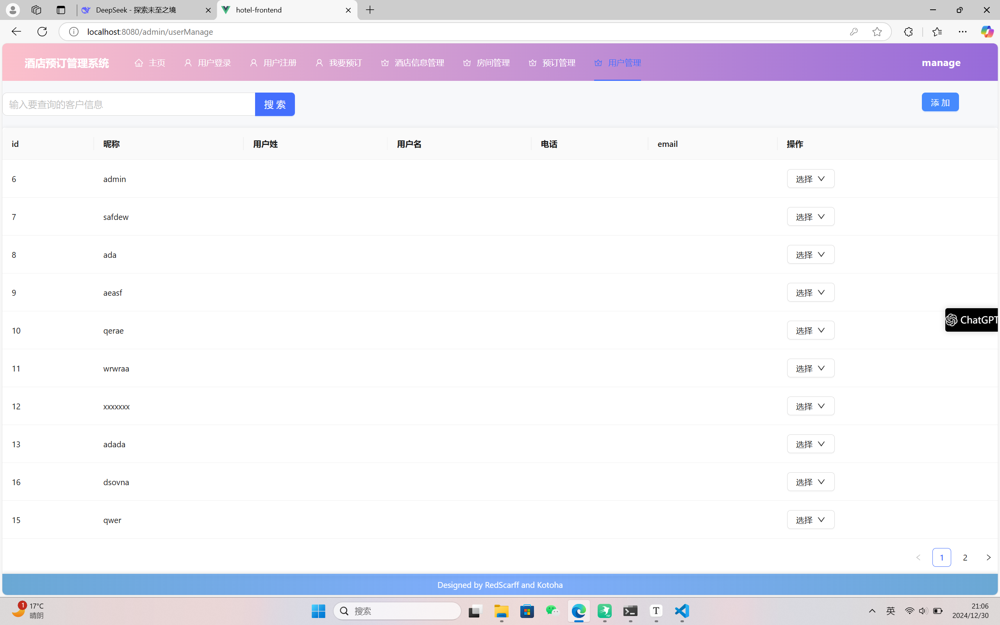

#### 8. 改进点

在酒店管理系统中，酒店名称可能较长，手动输入酒店名称不仅效率低下，还容易出错。为了提升用户体验，我们对酒店选择功能进行了优化，实现了**自动搜索酒店并弹出选择弹窗**的功能。以下是具体的实现细节：

1. **自动搜索酒店**

在用户输入酒店名称时，系统会自动触发搜索功能，实时匹配酒店名称并显示相关结果。这一功能通过 `a-select` 组件和 `fetchHotelOptions` 方法实现。

- **实现代码**：

  ```
  const fetchHotelOptions = async () => {
    loadingHotelData.value = true;
    try {
      const response = await searchHotels("", formState.token); // 调用 API 获取酒店数据
      if (response && Array.isArray(response.data)) {
        hotelOptions.value = response.data.map((hotel: any) => ({
          value: hotel.id, // 使用酒店的 id 作为 value
          label: `${hotel.name} - ${hotel.location}`, // 将酒店名称和地址结合为 label
        }));
      } else {
        hotelOptions.value = []; // 如果没有酒店数据，清空选项
      }
    } catch (error) {
      console.error("获取酒店信息失败:", error);
      message.error("获取酒店信息失败，请重试！");
    } finally {
      loadingHotelData.value = false; // 结束加载状态
    }
  };
  ```

- **功能说明**：

  - 调用 `searchHotels` API 获取所有酒店数据。
  - 将酒店数据映射为下拉框选项，格式为 `酒店名称 - 酒店地址`。
  - 用户无需手动输入酒店名称，只需从下拉框中选择即可。

2. **选择弹窗**

为了进一步提升用户体验，当用户点击酒店选择框时，系统会弹出一个选择弹窗，展示所有酒店信息。用户可以通过弹窗快速选择目标酒店。

- **实现代码**：

  ```
  <a-select v-model:value="formState.hotel" placeholder="选择酒店" @focus="fetchHotelOptions">
    <a-select-option v-for="hotel in hotelOptions" :key="hotel.value" :value="hotel.value">
      {{ hotel.label }}
    </a-select-option>
  </a-select>
  ```

- **功能说明**：

  - 当用户点击选择框时，触发 `@focus` 事件，调用 `fetchHotelOptions` 方法加载酒店数据。
  - 弹窗中展示所有酒店的名称和地址，用户可以通过滚动或搜索快速定位目标酒店。

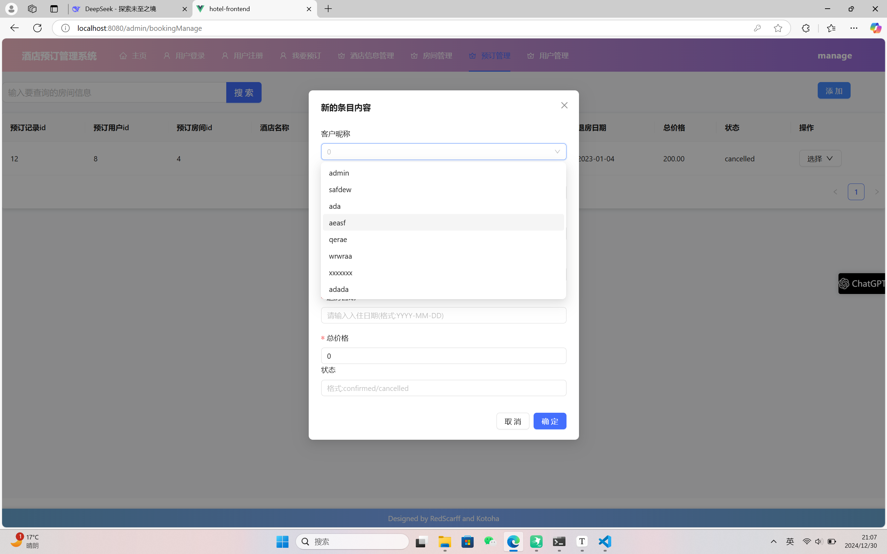

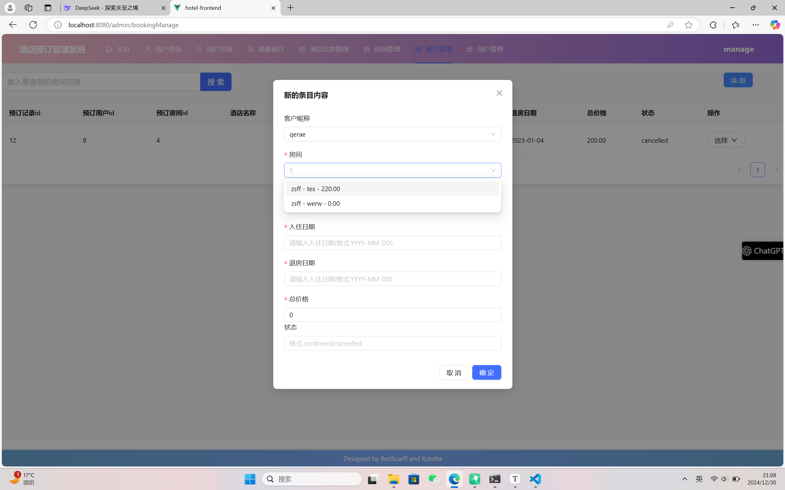

------

另外，在酒店管理系统中，当用户需要编辑某个条目（如酒店、房间、预订或用户信息）时，系统会自动将当前条目的已有信息填充到表单中。这一改进显著提升了用户体验，避免了用户重新输入所有信息，同时减少了操作步骤和出错的可能性。以下是具体的实现细节：

1. **自动填充功能的实现**

在编辑模式下，系统会获取当前选中条目的数据，并将这些数据自动填充到表单的对应字段中。这一功能通过 `handleEdit` 方法实现。

- **实现代码**：

  ```
  const handleEdit = (record?: any) => {
    visible.value = true; // 打开编辑弹窗
    if (record) {
      Object.assign(formState, record); // 将选中条目的数据填充到表单中
      formState.mode = "edit"; // 设置模式为编辑
    }
  };
  ```

- **功能说明**：

  - 当用户点击“编辑”按钮时，系统会获取当前选中条目的数据（`record`）。
  - 使用 `Object.assign` 方法将 `record` 中的数据赋值给 `formState`，从而自动填充表单字段。
  - 设置 `formState.mode` 为 `"edit"`，以便在提交时区分是编辑操作还是添加操作。

2. **表单字段绑定**

表单字段通过 `v-model` 与 `formState` 进行双向绑定，确保数据能够自动填充并实时更新。

- **实现代码**：

  ```
  <a-form ref="formRef" :model="formState" layout="vertical">
    <a-form-item label="酒店名" :rules="[{ required: true, message: '请输入酒店名!' }]">
      <a-input v-model:value="formState.name" />
    </a-form-item>
    <a-form-item label="地址" :rules="[{ required: true, message: '请输入酒店地址!' }]">
      <a-input v-model:value="formState.location" />
    </a-form-item>
    <a-form-item label="电话号" :rules="[{ required: true, message: '请输入酒店电话号!' }]">
      <a-input v-model:value="formState.phone" />
    </a-form-item>
    <a-form-item label="email" :rules="[{ required: true, message: '请输入酒店email!' }]">
      <a-input v-model:value="formState.email" />
    </a-form-item>
  </a-form>
  ```

- **功能说明**：

  - 每个表单字段通过 `v-model:value` 绑定到 `formState` 的对应属性。
  - 当 `formState` 中的数据发生变化时，表单字段会自动更新显示。

3. **编辑模式与添加模式的区分**

在编辑模式下，表单会自动填充已有信息；而在添加模式下，表单字段为空。系统通过 `formState.mode` 来区分这两种模式。

- **实现代码**：

  ```
  const handleAdd = () => {
    visible.value = true; // 打开添加弹窗
    formState.mode = "add"; // 设置模式为添加
    resetForm(); // 重置表单字段
  };
  
  const resetForm = () => {
    Object.assign(formState, {
      id: 0,
      name: "",
      location: "",
      phone: "",
      email: "",
      mode: "",
    });
    formRef.value.resetFields(); // 重置表单验证状态
  };
  ```

- **功能说明**：

  - 在添加模式下，调用 `resetForm` 方法清空表单字段。
  - 在编辑模式下，表单字段会自动填充已有信息，用户只需修改需要更新的部分。

4. **提交时的逻辑区分**

在提交表单时，系统会根据 `formState.mode` 的值决定是调用添加 API 还是编辑 API。

- **实现代码**：

  ```
  const onOk = () => {
    formRef.value
      .validateFields()
      .then(async (values) => {
        try {
          if (formState.mode === "add") {
            await addHotels(toRaw(formState)); // 调用添加 API
            message.success("酒店添加成功");
          } else if (formState.mode === "edit") {
            await editHotels(toRaw(formState)); // 调用编辑 API
            message.success("酒店信息更新成功");
          }
          fetchData(); // 刷新数据
        } catch (error) {
          message.error(
            formState.mode === "add" ? "添加酒店失败" : "更新酒店信息失败"
          );
        }
        resetForm(); // 重置表单
      })
      .catch((info) => {
        console.log("表单验证失败:", info);
      });
  };
  ```

- **功能说明**：

  - 如果 `formState.mode` 为 `"add"`，则调用 `addHotels` API 添加新条目。
  - 如果 `formState.mode` 为 `"edit"`，则调用 `editHotels` API 更新已有条目。

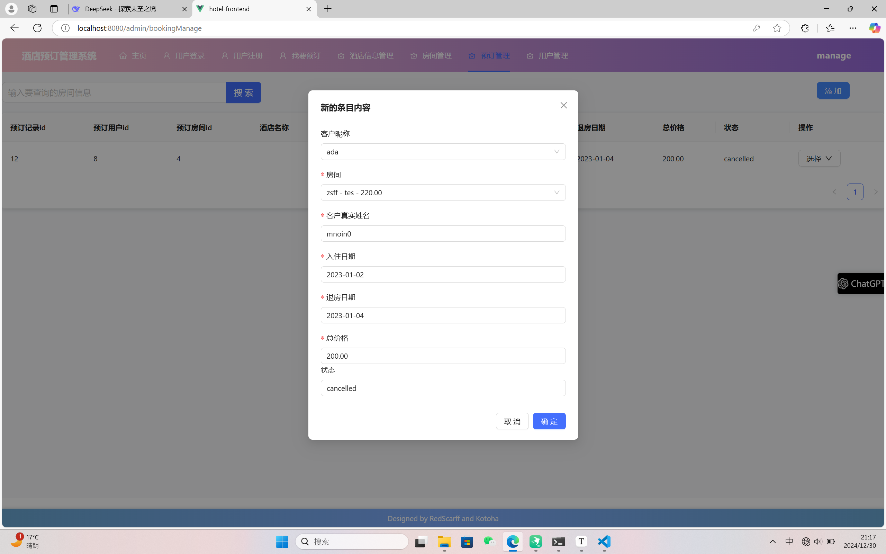

### f. 前端运行

请在hotel-frontend目录下 `npm run serve` 或  `pnpm run serve`，默认情况下，前端会运行在http://localhost:8080/

- 前端项目支持npm或pnpm，如果运行过程发现了某些库未安装手动安装一下即可
  可能没安装的库：`pnpm install axios` ，`pnpm install pinia`，当然如果用 npm 也是同理

- 前端在编写过程中使用了prettier进行代码规范化，可能不符合您的IDE设置，如果遇到格式之类的错误，可尝试 `npm run lint --fix` 进行修复

- 跨域问题已经在my_hotel/settings.py中解决

  ```
  CORS_ALLOWED_ORIGINS = [
      "http://localhost:8080",
      ]
  ```


## 7. 功能介绍

### a. customer

#### 1. 用户注册

进入注册界面进行注册


可以看到注册成功


#### 2. 用户登录

来到登录界面我们使用刚才注册的账号登录


可以看到登录成功


#### 3. 酒店查询

#### 4. 酒店预订

#### 5. 预定查询/修改

### b. manager

### 1. 酒店信息管理

进入酒店信息管理界面 我们可以看到所有的酒店


+ 我们可以进行修改


+ 可以看到成功进行修改


+ 也可以搜索酒店


+ 也可以删除酒店


+ 同样可以添加回来


### 2. 房间管理

查看房间信息


修改信息


增加删除


### 3. 预定管理

### 4. 用户管理

在这里可以管理用户信息

可以看到我们前面所注册的新用户账户user_test3


可以进行修改


同样新增删除


## 8. 项目总结

该项目是一个  **酒店预订管理系统** ，使用 **Django** 作为后端框架，**PostgreSQL** 作为数据库管理系统，前端部分可以选择 **Vue.js** 作为展示界面。系统主要功能包括用户管理、酒店管理、房间预订、预定历史等。

### 关键功能模块

1. **用户管理** ：

* 用户可以分为 **顾客 (Customer)** 和  **管理员 (Manager)** ，两者有不同的权限。
* 顾客只能进行房间查询和预定，而管理员可以进行酒店管理、房间管理等操作。
* 用户通过 **Django Rest Framework** 提供的 API 进行登录、注册，使用 **JWT token** 进行身份验证。

2. **酒店管理** ：

* 酒店管理员可以管理酒店信息，如酒店名称、地址等。
* 管理员还可以管理房间的添加、删除、修改等操作。

3. **预定系统** ：

* 顾客可以查看房间信息，并进行预订。
* 预订信息包括入住日期、退房日期、房间类型等。
* 系统支持查询和管理预定记录，包括查询订单历史等功能。

4. **权限管理** ：

* 使用 **Django 自带的权限系统** 进行角色管理，顾客和管理员有不同的权限。
* 使用 **JWT token** 进行身份认证，确保只有经过授权的用户能够访问特定的资源。

5. **前端与后端交互** ：

* 前端通过发送 HTTP 请求（如 GET、POST、PUT 等）与后端 API 进行交互。
* 前端请求可以包含 JWT token，后端通过权限验证用户身份。

### 技术栈

* **后端框架** ：Django + Django Rest Framework (DRF)
* **数据库** ：PostgreSQL
* **前端框架** ：Vue.js
* **认证方式** ：JWT (JSON Web Token)
* **部署** ：可能涉及 Docker、Nginx 等工具

### 结语

+ 后端：

作为一个不大不小的非常经典类型的项目，在一步一步开发的过程中，逐渐看到项目完备起来，还是有喜悦在其中的，从中也是学到了很多。总之，虽然内容略显陈旧无趣，开发的过程并不枯燥。

